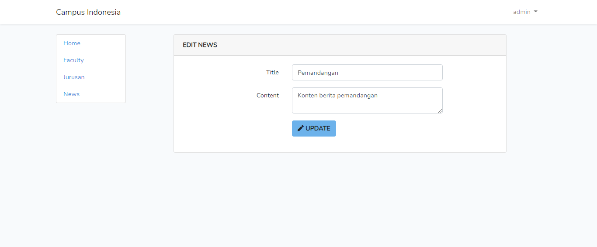

# Kampus Indonesia Backend Internship Test

## Penjelasan Aplikasi
Aplikasi ini dibuat menggunakan framework laravel dan bootstrap 4 scaffolding. Tujuan pembuatan aplikasi ini adalah untuk mengikuti seleksi internship di Kampus Indonesia. Aplikasi ini memiliki 4 model

- User (pengguna)
  User berfungsi untuk menyimpan data pengguna yang telah mendaftar aplikasi.
- Faculty (fakultas)
  Sebelum menambahkan jurusan harap menambahkan fakultas terlebih dahulu
- Major (jurusan)
- News (berita)

### Autentikasi
Aplikasi ini support 2 autentikasi yaitu autentikasi biasa dan google.

*agar autentikasi menggunakan google dan reset password bekerja harap atur setting Mail dan Google client server pada env anda

Aplikasi ini memiliki 2 level access yaitu admin dan user biasa

- Admin
  Admin memiliki hak untuk melihat, membuat, mengedit, dan menghapus model Faculty (fakultas), Major (jurusan), News(berita)
- User
  hak akses yang dimiliki User sama dengan guest (tidak memiliki account) yaitu hanya bisa melihat data yang sudah dibuat oleh admin

  ## ERD Database
  

  ## Screenshot Aplikasi
  - Landing Page
    

  - Register Page
    

  - Login Page
    

  - Forgot Password Email Notification
    

  - Google Authentication
    

  - Faculty Create Page
    

  - Faculty Index Page
    

  - Faculty Edit Page
    

  - Major Create Page
    
    
  - Major Index Page
    

  - Major Edit Page
    

  - Faculty Show Page
    

  -  News Create Page
    

  -  News Index Page
    

  -  News Show Page
    

  -  News Edit Page
        